# Descrição geral

Este projeto automatiza a vigilância da **Síndrome Respiratória Aguda Grave (SRAG)** no Brasil, gerando um relatório executivo por **UF** a partir de dados públicos do [OpenDataSUS](https://opendatasus.saude.gov.br). A aplicação orquestra, de ponta a ponta, a **ingestão**, os **cálculos de indicadores**, a **visualização de séries**, a **síntese de notícias** e a **renderização do relatório** — tudo com observabilidade, guardrails e modo offline.

O pipeline (exibido mais abaixo) segue o fluxo: **ingest → metrics → charts → news → report**. A ingestão pode ser **local** (com arquivos `.csv` em `data/raw/`) ou **remota** (URLs configuráveis no arquivo `.env`). As métricas são determinísticas (SQL/SQLite + Pandas) e incluem:

- **Variação de casos** mês a mês (`increase_rate`)
- **Taxa de mortalidade** (`deaths / cases`)
- **Taxa de UTI** (`icu_cases / cases`)
- **Proxy de vacinação** (`vaccinated_cases / cases`)

As **séries** são sequências temporais agregadas por **UF** usadas para visualizar a tendência de casos de SRAG. As séries de **30 dias** (diária) e **12 meses** (mensal) são plotadas em PNG. Opcionalmente, um LLM resume manchetes recentes sobre SRAG (Serper + OpenAI), com **fallback seguro** quando chaves/serviços não estão disponíveis — garantindo que a pipeline **não quebre** na ausência do LLM.

**Principais resultados gerados**

- **Relatório HTML**: `resources/reports/relatorio.html`. Relatório contendo as métricas **calculadas** e o resumo das notícias sobre SRAG.
- **PDF**: `resources/reports/relatorio.pdf`. Conversão direta do `.html` (via xhtml2pdf, quando disponível).
- **Gráficos**: `resources/charts/`. Séries diárias (30d) e mensais (12m) em PNG.
- **Log de auditoria**: `resources/json/events.jsonl`. Logs estruturados de **toda a execução** (pipeline e chamadas ao LLM), com spans `*.start/*.end/*.error`, duração e `run_id` de correlação.

**Qualidade, segurança e transparência**

- **Observabilidade**: spans por etapa, duração e erros em JSONL.  
- **Guardrails**: validação de UF, corte de datas futuras, timeouts/retries/backoff em APIs, sanitização de dados sensíveis nos logs e caminhos POSIX no HTML gerado (compatível com Windows).  
- **Privacidade**: o template bloqueia DataFrames/linhas brutas (somente agregados/indicadores e imagens).  
- **Confiabilidade**: contrato do relatório testado (KPIs com `data-testid`, imagens por caminhos relativos), suíte de testes e CI.

## Objetivo & Dados

### Objetivo

Gerar, para uma **UF** escolhida, um **relatório executivo** de vigilância da **SRAG** que consolida:

1) **Indicadores** determinísticos e comparáveis ao longo do tempo,  
2) **Séries temporais** (30 dias e 12 meses) para leitura visual de tendência,  
3) **Contexto de notícias** (opcional) para apoiar a interpretação.

### Fontes de dados

- **SRAG – OpenDataSUS**: arquivos `.csv` do Ministério da Saúde.  
  - **Local**: `data/raw/*.csv`  
  - **Remoto**: variável `.env` `SRAG_URLS` (lista de URLs separadas por vírgula)
- **Notícias (opcional)** — desligado por padrão no CI e em ambientes sem chaves; o pipeline segue sem quebrar:  
  - API **Serper** (Google News-like): títulos/links  
  - **OpenAI**: resumo curto

### Modelo de dados (SQLite)

Durante a ingestão, são criadas 4 tabelas com responsabilidades claras:

| Tabela           | Colunas principais                                     | Função                                                                 |
|------------------|---------------------------------------------------------|-------------------------------------------------------------------------|
| `srag_staging`   | `DT_SIN_PRI`, `EVOLUCAO`, `UTI`, `VACINA_COV`, `UF`    | **Raw minimal** (colunas essenciais), já com parsing e normalizações.   |
| `srag_base`      | `event_date`, `uf`, `death_flag`, `icu_flag`, `vaccinated_flag` | **Fatos** diários com flags derivadas e datas saneadas.                 |
| `srag_daily`     | `day`, `uf`, `cases`, `icu_cases`, `deaths`, `vaccinated_cases` | Agregação **diária** por UF.                                           |
| `srag_monthly`   | `month`, `uf`, `cases`, `icu_cases`, `deaths`, `vaccinated_cases` | Agregação **mensal** por UF (normalizada para `YYYY-MM-01`).           |

**Transformações-chave na ingestão**

- **Datas**: `DT_SIN_PRI` parseada de forma robusta (ISO `YYYY-MM-DD` ou `DD/MM/YYYY`).  
- **UF**: derivada por prioridade entre `SG_UF_NOT`, `SG_UF`, `SG_UF_RES` (fallback para UF padrão).  
- **Flags**:  
  - `death_flag = 1` se `EVOLUCAO == 2`  
  - `icu_flag = 1` se `UTI == 1`  
  - `vaccinated_flag = 1` se `VACINA_COV == 1`  
- **Agregações**:  
  - `srag_daily`: contagem por `day, uf`  
  - `srag_monthly`: contagem por `month, uf`  
- **Guardrails**: remoção de **datas futuras** (clamp), tipagens numéricas e defaults seguros quando colunas faltam.

### Indicadores calculados

| Indicador               | Fórmula / Definição                                                                          |
|-------------------------|-----------------------------------------------------------------------------------------------|
| **Variação de casos**   | `increase_rate = (cases_mês_atual - cases_mês_anterior) / cases_mês_anterior` (se ambos > 0) |
| **Taxa de mortalidade** | `mortality_rate = deaths / cases` no **mês mais recente**                                    |
| **Taxa de UTI**         | `icu_rate = icu_cases / cases` no **mês mais recente**                                       |
| **Proxy de vacinação**  | `vaccination_rate = vaccinated_cases / cases` no **mês mais recente**                        |

> Observação: os indicadores são **determinísticos** (SQL/Pandas). O LLM é usado somente para o **resumo de notícias**, nunca para métricas.

### Séries temporais

- **30 dias (diária)**: útil para perceber **aceleração / desaceleração** recente.  
- **12 meses (mensal)**: útil para contextualizar a **sazonalidade** e mudanças estruturais.

Ambas são salvas como **PNG** em `resources/charts/` e embutidas nos relatórios (`.html` e `.pdf`).

## Arquitetura

A aplicação segue um **pipeline orquestrado** em 5 etapas — `ingest → metrics → charts → news → report` — isolando responsabilidades, permitindo execução **offline** e garantindo observabilidade ponta-a-ponta.

### Diagrama (Mermaid)

> O diagrama fonte está em `resources/diagrams/app_flow.mmd`.

<p align="center">
  
</p>

### Componentes

- **Orchestrator (Agent/Graph)**: Encadeia os nós do pipeline, injeta run_id, aplica guardrails (validação de UF, corte de datas futuras) e consolida o contrato de saída.
- **Ingestão (Local/Remote) → SQLite**: Carrega os arquivos `.csv` (local em `data/raw/` ou remoto via `SRAG_URLS`), normaliza datas/UF, cria tabelas `srag_staging`, `srag_base`, `srag_daily` e `srag_monthly`.
- **Metrics**: Lê o SQLite e calcula KPIs determinísticos: `increase_rate`, `mortality_rate`, `icu_rate`, `vaccination_rate`. Também expõe séries: 30 dias (diária) e 12 meses (mensal).
- **Charts**: Converte as séries em PNGs em `resources/charts/` (nomes padronizados); os caminhos são referenciados **relativamente** no HTML.
- **News (opcional)**: Busca manchetes (**Serper**) e gera resumo curto (**OpenAI**). Inclui timeouts/retries/backoff e fallback seguro (pipeline segue sem LLM/keys).
- **Report (Renderer)**: Renderiza `report.html.j2` para o arquivo `relatorio.html` (e tenta a **conversão** para PDF via xhtml2pdf). Privacy guard: bloqueia DataFrames/Series no contexto do template.
- **Observability (Audit)**: `audit_span()` e `write_event()` registram *.start/*.end/*.error, duração e contexto em `resources/json/events.jsonl`.

### Contrato de execução

```python
from src.agents.orchestrator import run_pipeline

out = run_pipeline("SP")
# Retorno canônico:
# {
#   "uf": "SP",
#   "metrics": {...},           # KPIs + séries
#   "news_summary": "…",        # texto (ou fallback seguro)
#   "chart_30d": "charts/…png", # relative path (ou None)
#   "chart_12m": "charts/…png", # relative path (ou None)
#   "html_path": "resources/reports/relatorio.html",
#   "pdf_path": "resources/reports/relatorio.pdf" | None
# }

```

### Modos de ingestão

- **Local**: usa arquivos em `data/raw/*.csv`.
- **Remoto**: usa SRAG_URLS no `.env` (1+ URLs).
- **Auto**: prioriza local se houver arquivos; caso contrário, remoto.

> CI/Offline: testes rodam com live desativado; news entra em modo “no-LLM/no-Serper” sem quebrar o pipeline.

### Guardrails & Qualidade

- Validação de UF; clamp de datas futuras; normalização POSIX para caminhos das imagens;
- Timeouts/retries/backoff em chamadas externas; sanitização de payloads nos logs;
- KPIs arredondados antes do template; data-testid nos KPIs do HTML;
- Suíte de testes cobrindo ingestão, métricas, contrato do relatório e auditoria; CI no GitHub Actions.

## Tecnologias & Stack

A Stack escolhida tem o objetivo de ser **portátil**, **determinística** e **possibilitar a execução em modo offline**. Em vez de depender de serviços ou binários externos, foi priorizado ferramentas *Python puras* e um banco de dados local simples (SQLite) para que qualquer pessoa consiga rodar o pipeline inteiro com o mínimo de fricção. O armazenamento e a transformação de dados usam **SQLite + Pandas**: o banco garante consultas reproduzíveis e rápidas para o volume do projeto, enquanto o Pandas facilita agregações e o preparo das séries temporais. O *schema* dos dados é materializado em quatro tabelas (`srag_staging`, `srag_base`, `srag_daily`, `srag_monthly`), com o objetivo de manter linhas claras entre **ingestão**, **fatos derivados** e **agregações**.

A **orquestração** da pipeline é feita com **LangGraph**, que nos dá um grafo explícito de etapas (`ingest → metrics → charts → news → report`). Essa estrutura visa facilitar a auditoria, controle de fluxo, reutilização e garante um **contrato de saída** estável. Foram criados Guardrails para validação de UF, *clamp* de datas futuras, normalização de caminhos no próprio grafo, junto com *spans* de auditoria e *logging* estruturado.

As **visualizações** usam **Matplotlib/Seaborn** para gerar arquivos PNGs com as imagens dos relatórios do projeto. A **renderização do relatório** fica a cargo da ferramenta **Jinja2** (HTML) e a ferramenta **xhtml2pdf** faz a conversão utilizando *Python* para PDF. Os caminhos dos arquivos são normalizados para **POSIX** ao embutir imagens, garantindo que o HTML/PDF abra corretamente tanto no Windows quanto no Linux.

Integrações externas são **opcionais**: A biblioteca **requests** faz chamadas HTTP e **OpenAI + Serper** servem apenas para o resumo de notícias. Quando não há chaves ou acesso às ferramentas, entram *fallbacks* de segurança e a pipeline segue normalmente, preservando a funcionalidade do projeto. A configuração é centralizada via `.env` e lida com `python-dotenv`.

Para **qualidade e observabilidade**, o projeto usa **pytest** (incluindo testes de contrato do relatório e do orquestrador), **Ruff** (lint e formatação) e um **logger/audit** próprio que grava JSONL com `*.start/*.end/*.error`, duração e `run_id` de execução. Isso fornece rastreabilidade, diagnósticos rápidos e segurança de que mudanças não quebrem o contrato esperado.

### Mapa tecnologia → responsabilidade

| Tecnologia            | Responsabilidade principal                                      |
|----------------------|------------------------------------------------------------------|
| SQLite               | Persistência leve e portátil                                     |
| SQLAlchemy           | Engine/execução SQL e conexão com SQLite                         |
| Pandas               | Agregações determinísticas e séries temporais                    |
| LangGraph            | Orquestração em grafo e controle de fluxo                        |
| Seaborn / Matplotlib | Geração de gráficos (PNG) das séries 30d/12m                     |
| Jinja2               | Template do relatório HTML (`report.html.j2`)                    |
| xhtml2pdf            | Conversão HTML → PDF (opcional, *Python*)                   |
| Requests             | HTTP para ingestão remota / APIs                                 |
| OpenAI / Serper      | Resumo de notícias (opcional; com *fallback* quando indisponíveis)|
| Pytest               | Suíte de testes (inclui contrato do relatório/orquestrador)      |
| Ruff                 | Lint e formatação (all-in-one)                                   |
| Logger/Audit (JSONL) | Observabilidade: spans, duração, erros, `run_id`                 |
| python-dotenv        | Leitura de configuração por `.env`                               |

Em resumo: a stack foca em **simplicidade operacional**, **execução offline confiável** e **contratos testáveis**.
